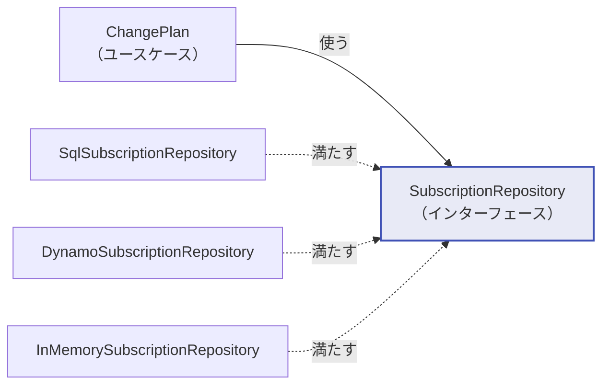

# レイヤーと依存の向き

## 4 つの層

| 層 | Python | Go | 中身 | 依存してよい相手 |
|---|---|---|---|---|
| ドメイン | `domain/` | `internal/domain/` | エンティティ、値オブジェクト、ドメインサービス | **なし**（標準ライブラリのみ） |
| ユースケース | `application/` | `internal/usecase/` | アプリケーション固有の手順、ポート定義 | ドメイン |
| インフラ | `infrastructure/` | `internal/infra/` | DB、決済代行、時計の実装 | ドメイン、ユースケース |
| プレゼンテーション | `presentation/` | `internal/adapter/`, `internal/app/` | HTTP、合成ルート | すべて |

## 依存の向きをテストで守る

クリーンアーキテクチャの唯一のルールは「依存は内側にしか向かない」です。
そしてこれは、**レビューで守るものではなくテストで守るもの**です。
図をいくら描いても、締切前にドメイン層から SQLAlchemy を import する人は必ず現れます。

=== "Python"

    `python/tests/unit/test_layer_dependencies.py` が、各モジュールの AST を解析して
    import を集め、層をまたぐ違反を検出します。

    ```python
    ALLOWED_EXTERNAL: dict[str, set[str]] = {
        "domain": set(),        # 標準ライブラリだけ
        "application": set(),   # ポート越しにしか外に触れない
        "infrastructure": {"sqlalchemy", "boto3", "botocore"},
        "presentation": {"fastapi", "pydantic", "starlette"},
    }
    ```

=== "Go"

    `go/internal/arch/layers_test.go` が `go/parser` で同じことをします。

    ```go
    var allowedInternal = map[string][]string{
        "domain":  {},
        "usecase": {"domain"},
        "infra":   {"domain", "usecase"},
        "adapter": {"domain", "usecase"},
        "app":     {"domain", "usecase", "infra", "adapter"},
    }
    ```

!!! success "このテストは実際に仕事をしました"
    開発中、合成ルート（`presentation/container.py`）が DynamoDB クライアントを作るために
    `import boto3` と書いていました。層としては最外なので動きはしますが、
    「プレゼンテーション層が AWS SDK に依存する」のは筋が悪い。

    テストがこれを検出したので、クライアントの生成を
    `infrastructure/persistence/dynamo/client.py` に移しました。
    合成ルートが決めるのは**どの実装を選ぶか**であって、
    **その実装をどう作るか**はインフラ層の中に留めるべきだからです。

## 依存性逆転はどこで起きているか

ユースケースは「集約を出し入れする何か」を要求するだけで、それが PostgreSQL なのか
`dict` なのかを知りません。



実線の矢印（使う）と点線の矢印（満たす）が逆を向いているのが依存性逆転です。
実行時には `ChangePlan` が `SqlSubscriptionRepository` を呼びますが、
**コンパイル時の依存はどちらも内側のインターフェースに向かっています**。

インターフェースを具体的にどこへ置くかは、言語の慣習によって変わります。
詳細は [ADR-0002](adr/0002-where-interfaces-live.md) を参照してください。

## 合成ルート

「何がどこに注入されているか」を 1 箇所に集めています。
DI コンテナライブラリは使っていません。

=== "Python"

    `python/src/billing/presentation/container.py`

    ```python
    def _build_uow_factory(settings: Settings) -> UnitOfWorkFactory:
        match settings.persistence:
            case PersistenceKind.MEMORY:
                database = MemoryDatabase()
                return lambda: InMemoryUnitOfWork(database)
            case PersistenceKind.SQLITE:
                engine = create_sqlite_engine(settings.database_url)
                create_schema(engine)
                return lambda: SqlAlchemyUnitOfWork(engine)
            case PersistenceKind.DYNAMODB:
                client = create_dynamo_client(...)
                return lambda: DynamoUnitOfWork(client, settings.dynamo_table)
    ```

=== "Go"

    `go/internal/app/container.go`

    ```go
    func buildFactory(ctx context.Context, cfg Config) (usecase.UnitOfWorkFactory, func() error, error) {
        switch cfg.Persistence {
        case PersistenceMemory:
            return memory.NewUnitOfWorkFactory(memory.NewDatabase()), nil, nil
        case PersistenceSQLite:
            db, err := sqlite.Open(cfg.DatabaseDSN)
            ...
            return sqlite.NewUnitOfWorkFactory(db), func() error { return db.Close() }, nil
        }
    }
    ```

DI コンテナは配線を**隠す**道具であって、**なくす**道具ではありません。
この規模なら、配線がそのまま読めるほうが価値があります。

## エラーはどこで HTTP になるか

ドメイン層は 409 という数字を知りません。知る必要もありません。

| 送出元 | 例外 / エラー | HTTP | 理由 |
|---|---|---|---|
| ドメイン | `IllegalTransition` | 409 | 資源の現在の状態と要求が両立しない |
| ドメイン | `InvariantViolation` | 422 | ビジネスルールに反する入力 |
| ユースケース | `EntityNotFound` | 404 | 対象が存在しない |
| ユースケース | `ConcurrencyConflict` | 409 | 誰かが先に更新した |
| ユースケース | `ConflictingRequest` | 409 | 冪等キーの使い回し |

翻訳表は `presentation/api/errors.py` と `internal/adapter/http/errors.go` にあります。
同じエラーを gRPC で返すなら `FAILED_PRECONDITION` に、CLI なら終了コードに、
それぞれの境界で好きに訳せます。
