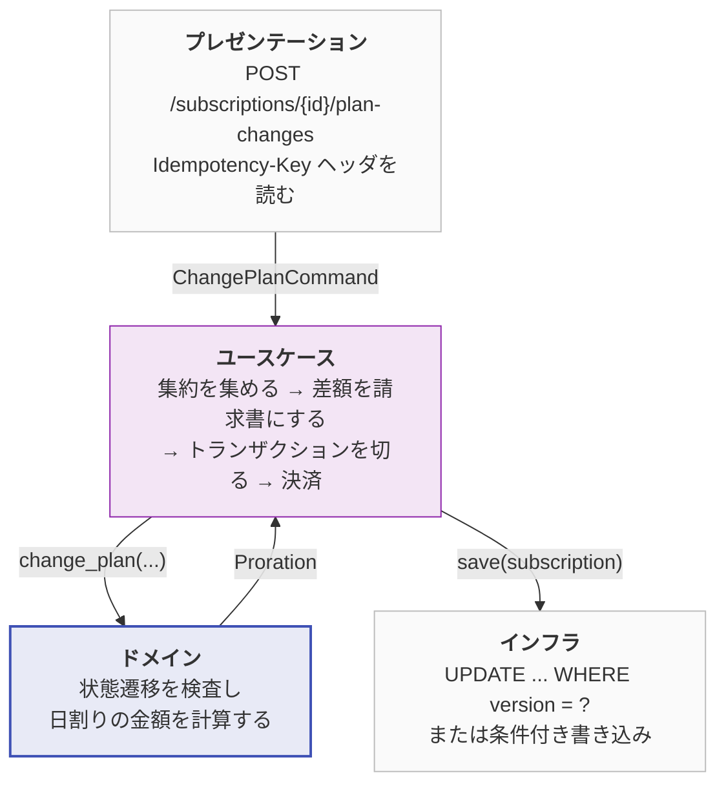
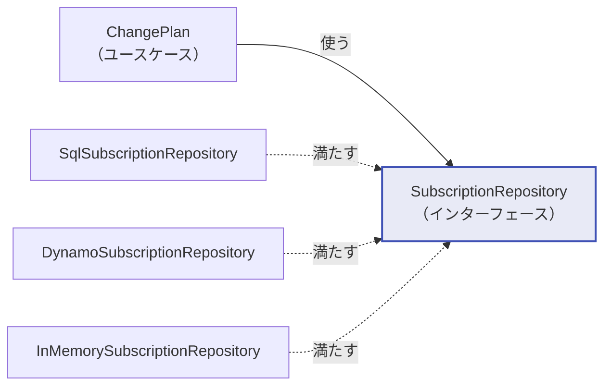

# レイヤーと依存の向き

## 4 つの層

| 層 | Python | Go | 中身 | 依存してよい相手 |
|---|---|---|---|---|
| ドメイン | `domain/` | `internal/domain/` | エンティティ、値オブジェクト、ドメインサービス | **なし**（標準ライブラリのみ） |
| ユースケース | `application/` | `internal/usecase/` | アプリケーション固有の手順、ポート定義 | ドメイン |
| インフラ | `infrastructure/` | `internal/infra/` | DB、決済代行、時計の実装 | ドメイン、ユースケース |
| プレゼンテーション | `presentation/` | `internal/adapter/`, `internal/app/` | HTTP、合成ルート | すべて |

以下、**「1 月の途中で Basic から Pro にプランを変更する」という 1 つの操作**が
4 つの層をどう通っていくかを、実際のコードで追います。



### ドメイン層 — ルールだけを書く

**このパッケージが import しているのは標準ライブラリだけです。**
DB もフレームワークもネットワークも現れません。

この層に置くものの分類（エンティティ・値オブジェクト・集約・ドメインサービス）には
DDD の語彙を使っています。用語の意味は [DDD の用語](ddd-glossary.md) を参照してください。

プラン変更のルールそのものは、集約のメソッドとして書かれています。

=== "Python"

    ```python title="domain/subscription.py"
    def change_plan(self, *, current_plan: Plan, new_plan: Plan, at: datetime) -> Proration:
        """プランを変更し、その期間ぶんの差額を返す。

        差額の請求書を作るのはこの集約の仕事ではない。ここが返すのは「いくらか」と
        いう事実だけで、それを請求書にするか、次回請求に繰り越すかは呼び出し側が決める。
        """
        at = ensure_aware(at, field="at")
        if self.is_terminated:
            raise IllegalTransition("subscription", self.status, "change plan of")
        if current_plan.id != self.plan_id:
            raise InvariantViolation(...)
        if new_plan.id == self.plan_id:
            raise InvariantViolation(f"already on plan {new_plan.id!r}")

        if self.status is SubscriptionStatus.TRIALING:
            # 試用中はまだ 1 円も請求していないので、返すものも取るものもない。
            zero = Money.zero(current_plan.price.currency)
            proration = Proration(credit=zero, charge=zero)
        else:
            proration = prorate(
                period=self.current_period, at=at,
                old_price=current_plan.price, new_price=new_plan.price,
            )

        self.plan_id = new_plan.id
        self._record("subscription.plan_changed", at)
        return proration
    ```

=== "Go"

    ```go title="internal/domain/subscription.go"
    func (s *Subscription) ChangePlan(currentPlan, newPlan Plan, at time.Time) (Proration, error) {
        at = EnsureUTC(at)
        if s.IsTerminated() {
            return Proration{}, IllegalTransition("subscription", string(s.Status), "change plan of")
        }
        if currentPlan.ID != s.PlanID {
            return Proration{}, Invalid(...)
        }
        if newPlan.ID == s.PlanID {
            return Proration{}, Invalid("already on plan %q", newPlan.ID)
        }

        var proration Proration
        var err error
        if s.Status == StatusTrialing {
            zero := currentPlan.Price.Zero()
            proration = Proration{Credit: zero, Charge: zero}
        } else {
            proration, err = Prorate(s.CurrentPeriod, at, currentPlan.Price, newPlan.Price)
            if err != nil {
                return Proration{}, err
            }
        }

        s.PlanID = newPlan.ID
        s.record("subscription.plan_changed", at)
        return proration, nil
    }
    ```

注目してほしいのは 2 点です。

**1. 時刻を引数で受け取っている。** `datetime.now()` を呼んでいません。
これがあるだけで「猶予期間を 14 日過ぎたら解約される」を 14 日待たずにテストできます。

**2. `Plan` を引数で受け取っている。** 集約は `plan_id` しか持たず、
プランの実体を抱え込みません。抱え込むと「契約を 1 件読むためにプランも必ず読む」
という結合が生まれます。**必要なものを持ってくるのは呼び出し側の仕事**です。

金額の丸め方針も、この層の 1 箇所に閉じています。

=== "Python"

    ```python title="domain/money.py"
    def scale(self, ratio: Fraction) -> Money:
        """比率を掛けて最小単位に丸める。

        丸めは切り捨て（floor）で統一する。日割りでは事業者側ではなく利用者側に
        有利な方向に倒す、という方針をここで一箇所に閉じ込めている。方針を変えたく
        なったら変えるのはこのメソッドだけで済む。
        """
        if ratio < 0:
            raise InvariantViolation(f"ratio must not be negative, got {ratio}")
        scaled = Fraction(self.amount) * ratio
        return Money(scaled.numerator // scaled.denominator, self.currency)
    ```

=== "Go"

    ```go title="internal/domain/money.go"
    func (m Money) Scale(ratio *big.Rat) (Money, error) {
        if ratio.Sign() < 0 {
            return Money{}, Invalid("ratio must not be negative, got %s", ratio.String())
        }
        scaled := new(big.Rat).Mul(new(big.Rat).SetInt64(m.Amount), ratio)
        // big.Int の Quo は 0 方向への切り捨て。金額は常に非負で使うため floor と一致する。
        truncated := new(big.Int).Quo(scaled.Num(), scaled.Denom())
        return Money{Amount: truncated.Int64(), Currency: m.Currency}, nil
    }
    ```

!!! danger "この層に書かないもの"
    - **請求書を作ること**。`Invoice` は別の集約です。返すのは `Proration`（金額の事実）まで。
    - **保存すること**。`self.save()` のようなメソッドはありません。
    - **現在時刻を取ること**。上で見たとおり引数で受け取ります。
    - **メールを送ること**。代わりに `_record("subscription.plan_changed", at)` で
      「起きたこと」を残し、それを何に使うかは外側に委ねます。

### ユースケース層 — 段取りだけを書く

「どの集約をどの順で触り、どこで外部システムを叩き、どこでトランザクションを切るか」
を決めるのがこの層です。

```python title="application/usecases/change_plan.py"
proration = subscription.change_plan(          # (1)
    current_plan=current_plan, new_plan=new_plan, at=now
)

invoice: Invoice | None = None
if proration.net.is_positive:                  # (2)
    invoice = Invoice.issue(
        id=InvoiceId(self._ids.new_id()),
        customer_id=subscription.customer_id,
        subscription_id=subscription.id,
        lines=[
            InvoiceLine(f"{current_plan.name} 未使用分", -proration.credit),
            InvoiceLine(f"{new_plan.name} 残期間分", proration.charge),
        ],
        currency=proration.net.currency,
        at=now,
        idempotency_key=command.idempotency_key,
    )
    uow.invoices.add(invoice)

uow.subscriptions.save(subscription)
uow.commit()                                   # (3)
```

1.  金額の計算はドメインに任せる。ここでは呼ぶだけ。
2.  「差額が正なら請求書を出す」という**アプリケーションの方針**。
    いくらになるかはドメインが決め、それを何に変換するかはここが決める。
3.  トランザクション境界を明示的に閉じる。自動 commit にしていないのは、
    途中で `return` したときに意図せず commit される事故を防ぐため。

**このコードに四則演算が 1 つも出てこない**のが要点です。
ユースケース層に `if` が並んで金額を計算し始めたら、
それはドメインに書くべきものが漏れています。

外部システムが必要なときは、この層が**インターフェースを定義して要求**します。

```python title="application/ports.py"
class Clock(Protocol):
    """現在時刻の供給源。

    ``datetime.now()`` を直接呼ぶコードはテストできない。「猶予期間を 14 日過ぎたら
    解約される」を検証するのに、14 日待つわけにはいかない。時刻を注入可能にすると、
    その手のテストが数ミリ秒で書ける。
    """

    def now(self) -> datetime:
        """tz-aware な現在時刻（UTC）を返す。"""
        ...
```

`Clock`、`PaymentGateway`、`IdGenerator`、`UnitOfWork` の 4 つがここにあります。
リポジトリのインターフェースだけは Python ではドメイン層に置いていますが、
これは言語の慣習に合わせた判断です（[ADR-0002](adr/0002-where-interfaces-live.md)）。

!!! danger "この層に書かないもの"
    - **金額の計算**。日割りの式が現れたら、ドメインに移すべき合図です。
    - **SQL や HTTP**。`uow.subscriptions.save(...)` としか書かれていません。
    - **どの実装を使うかの選択**。それは合成ルートの仕事です。

### インフラ層 — 技術の詳細だけを書く

同じ `save` が、SQL と DynamoDB でどう違うかを並べます。
**呼び出し側から見たシグネチャは 1 文字も違いません。**

=== "SQLite"

    ```python title="infrastructure/persistence/sql/repositories.py"
    def save(self, subscription: Subscription) -> None:
        entity_id = str(subscription.id)
        expected = self._versions.expected(entity_id)
        result = self._conn.execute(
            subscriptions.update()
            .where(
                and_(
                    subscriptions.c.id == entity_id,
                    subscriptions.c.version == expected,
                )
            )
            .values(**mappers.subscription_to_row(subscription), version=expected + 1)
        )
        if result.rowcount != 1:
            # 誰かが先に更新した。ここで黙って上書きすると、相手の変更が消える。
            raise self._versions.conflict(entity_id)
        self._versions.bump(entity_id)
    ```

=== "DynamoDB"

    ```python title="infrastructure/persistence/dynamo/repositories.py"
    def save(self, subscription: Subscription) -> None:
        entity_id = str(subscription.id)
        expected = self._versions.expected(entity_id)
        self._session.stage(
            key=subscription_key(subscription.id),
            item=mappers.subscription_to_item(subscription, version=expected + 1),
            condition=_VERSION_UNCHANGED,          # "version = :expected_version"
            values={":expected_version": expected},
            entity="subscription",
            entity_id=entity_id,
        )
        self._versions.bump(entity_id)
    ```

=== "インメモリ"

    ```python title="infrastructure/persistence/memory/repositories.py"
    def save(self, subscription: Subscription) -> None:
        entity_id = str(subscription.id)
        if not self._exists(subscription.id):
            raise UnknownEntity(f"subscription {entity_id!r} does not exist")
        expected = self._versions.expected(entity_id)
        # 楽観ロックの判定は、staging ではなくコミット済みの実体に対して行う。
        committed = self._db.versions.get(entity_id)
        if committed is not None and committed != expected:
            raise self._versions.conflict(entity_id)
        self._staging.subscriptions[subscription.id] = deepcopy(subscription)
        self._staging.versions[entity_id] = self._versions.bump(entity_id)
    ```

3 つとも「読んだときのバージョンが変わっていないことを条件に書く」という
同じ意味論を実装しています。それを `UPDATE ... WHERE` で表現するか
`ConditionExpression` で表現するかは、**この層の中だけの話**です。

そしてバージョン番号は**ドメインオブジェクトに持たせていません**。
リポジトリが「この UnitOfWork の中で、この ID をバージョン幾つで読んだか」を覚えます
（[ADR-0004](adr/0004-optimistic-locking.md)）。

この層がもう 1 つ引き受けるのが、**値オブジェクトとテーブルの対応づけ**です。

```python title="infrastructure/persistence/sql/mappers.py"
def plan_to_row(plan: Plan) -> dict[str, Any]:
    return {
        "id": str(plan.id),
        "name": plan.name,
        "price_amount": plan.price.amount,
        "price_currency": plan.price.currency,
        "interval": str(plan.interval),
    }


def subscription_to_row(subscription: Subscription) -> dict[str, Any]:
    return {
        "id": str(subscription.id),
        ...
        "period_start": to_iso(subscription.current_period.start),
        "period_end": to_iso(subscription.current_period.end),
        ...
    }
```

`Money` は 1 つの値オブジェクトですが、テーブルでは `price_amount` と `price_currency`
の 2 列になります。`BillingPeriod` も `period_start` と `period_end` に分かれます。
**ドメインで 1 つの概念だったものが、テーブルでは 2 列に散る。**
この対応づけを引き受けるのがこの層の仕事で、その代わり
**ドメインは正規化やインデックスの都合から自由**でいられます
（[ADR-0003](adr/0003-hand-written-mappers.md)）。

!!! danger "この層に書かないもの"
    - **業務上の判断**。「差額が正なら請求する」はユースケース、
      「日割りはいくらか」はドメインの仕事です。
    - **技術固有の例外を外に漏らすこと**。`IntegrityError` も
      `ConditionalCheckFailed` もこの層で翻訳しきります。

    ```python
    except IntegrityError as exc:
        # SQLAlchemy 固有の例外をここで止める。上の層に IntegrityError が
        # 漏れると、ユースケースが SQLAlchemy を import する羽目になる。
        raise DuplicateEntity(...) from exc
    ```

### プレゼンテーション層 — 形式の変換だけを書く

ハンドラがやることは 3 つだけです。リクエストをコマンドに変換し、ユースケースを呼び、
結果をレスポンスに変換する。

=== "Python"

    ```python title="presentation/api/routers/subscriptions.py"
    @router.post("/{subscription_id}/plan-changes", summary="プラン変更と日割り請求")
    def change_plan(
        container: ContainerDep,
        subscription_id: str,
        body: ChangePlanRequest,
        idempotency_key: Annotated[str, Header(alias="Idempotency-Key")],
    ) -> ChangePlanResponse:
        # 冪等キーを任意ではなく必須にしている。「再送しても安全な API」は、クライアントが
        # 気を利かせたときだけ成立する性質であってはならない。
        result = container.change_plan.execute(
            ChangePlanCommand(
                subscription_id=subscription_id,
                new_plan_id=body.new_plan_id,
                idempotency_key=idempotency_key,
            )
        )
        return ChangePlanResponse(
            subscription=SubscriptionResponse.of(result.subscription),
            proration=ProrationResponse.of(result.proration),
            invoice=None if result.invoice is None else InvoiceResponse.of(result.invoice),
        )
    ```

=== "Go"

    ```go title="internal/adapter/http/server.go"
    func (h Handlers) changePlan(w http.ResponseWriter, r *http.Request) {
        key := r.Header.Get("Idempotency-Key")
        if key == "" {
            writeJSON(w, http.StatusUnprocessableEntity, errorJSON{
                Error:  "missing_idempotency_key",
                Detail: "the Idempotency-Key header is required for plan changes",
            })
            return
        }
        body, ok := decode[changePlanRequest](w, r, h)
        if !ok {
            return
        }
        result, err := h.ChangePlan.Execute(r.Context(), usecase.ChangePlanCommand{
            SubscriptionID: r.PathValue("id"),
            NewPlanID:      body.NewPlanID,
            IdempotencyKey: key,
        })
        if err != nil {
            h.writeError(w, err)
            return
        }
        writeJSON(w, http.StatusOK, changePlanResponse{...})
    }
    ```

Pydantic モデルと JSON 構造体は、この層の外に出しません。
ユースケースは `application/dto.py` の素の dataclass だけを受け取り、返します。
境界で 1 回変換する手間を引き受ける代わりに、
**「API の互換性のためにフィールド名を変えたい」がドメインに波及しなくなります**。

!!! danger "この層に書かないもの"
    - **業務ルール**。ここに `if` が増え始めたら、CLI やバッチから同じことをしたく
      なったときに失われます。
    - **どの実装を使うかの判断**。それは同じ層にある[合成ルート](#合成ルート)が持ちます。

## 依存の向きをテストで守る

クリーンアーキテクチャの唯一のルールは「依存は内側にしか向かない」です。
そしてこれは、**レビューで守るものではなくテストで守るもの**です。
図をいくら描いても、締切前にドメイン層から SQLAlchemy を import する人は必ず現れます。

=== "Python"

    `python/tests/unit/test_layer_dependencies.py` が、各モジュールの AST を解析して
    import を集め、層をまたぐ違反を検出します。

    ```python
    ALLOWED_EXTERNAL: dict[str, set[str]] = {
        "domain": set(),        # 標準ライブラリだけ
        "application": set(),   # ポート越しにしか外に触れない
        "infrastructure": {"sqlalchemy", "boto3", "botocore"},
        "presentation": {"fastapi", "pydantic", "starlette"},
    }
    ```

=== "Go"

    `go/internal/arch/layers_test.go` が `go/parser` で同じことをします。

    ```go
    var allowedInternal = map[string][]string{
        "domain":  {},
        "usecase": {"domain"},
        "infra":   {"domain", "usecase"},
        "adapter": {"domain", "usecase"},
        "app":     {"domain", "usecase", "infra", "adapter"},
    }
    ```

!!! success "このテストは実際に仕事をしました"
    開発中、合成ルート（`presentation/container.py`）が DynamoDB クライアントを作るために
    `import boto3` と書いていました。層としては最外なので動きはしますが、
    「プレゼンテーション層が AWS SDK に依存する」のは筋が悪い。

    テストがこれを検出したので、クライアントの生成を
    `infrastructure/persistence/dynamo/client.py` に移しました。
    合成ルートが決めるのは**どの実装を選ぶか**であって、
    **その実装をどう作るか**はインフラ層の中に留めるべきだからです。

## 依存性逆転はどこで起きているか

ユースケースは「集約を出し入れする何か」を要求するだけで、それが PostgreSQL なのか
`dict` なのかを知りません。



実線の矢印（使う）と点線の矢印（満たす）が逆を向いているのが依存性逆転です。
実行時には `ChangePlan` が `SqlSubscriptionRepository` を呼びますが、
**コンパイル時の依存はどちらも内側のインターフェースに向かっています**。

インターフェースを具体的にどこへ置くかは、言語の慣習によって変わります。
詳細は [ADR-0002](adr/0002-where-interfaces-live.md) を参照してください。

## 合成ルート

「何がどこに注入されているか」を 1 箇所に集めています。
DI コンテナライブラリは使っていません。

=== "Python"

    `python/src/billing/presentation/container.py`

    ```python
    def _build_uow_factory(settings: Settings) -> UnitOfWorkFactory:
        match settings.persistence:
            case PersistenceKind.MEMORY:
                database = MemoryDatabase()
                return lambda: InMemoryUnitOfWork(database)
            case PersistenceKind.SQLITE:
                engine = create_sqlite_engine(settings.database_url)
                create_schema(engine)
                return lambda: SqlAlchemyUnitOfWork(engine)
            case PersistenceKind.DYNAMODB:
                client = create_dynamo_client(...)
                return lambda: DynamoUnitOfWork(client, settings.dynamo_table)
    ```

=== "Go"

    `go/internal/app/container.go`

    ```go
    func buildFactory(ctx context.Context, cfg Config) (usecase.UnitOfWorkFactory, func() error, error) {
        switch cfg.Persistence {
        case PersistenceMemory:
            return memory.NewUnitOfWorkFactory(memory.NewDatabase()), nil, nil
        case PersistenceSQLite:
            db, err := sqlite.Open(cfg.DatabaseDSN)
            ...
            return sqlite.NewUnitOfWorkFactory(db), func() error { return db.Close() }, nil
        }
    }
    ```

DI コンテナは配線を**隠す**道具であって、**なくす**道具ではありません。
この規模なら、配線がそのまま読めるほうが価値があります。

## エラーはどこで HTTP になるか

ドメイン層は 409 という数字を知りません。知る必要もありません。

| 送出元 | 例外 / エラー | HTTP | 理由 |
|---|---|---|---|
| ドメイン | `IllegalTransition` | 409 | 資源の現在の状態と要求が両立しない |
| ドメイン | `InvariantViolation` | 422 | ビジネスルールに反する入力 |
| ユースケース | `EntityNotFound` | 404 | 対象が存在しない |
| ユースケース | `ConcurrencyConflict` | 409 | 誰かが先に更新した |
| ユースケース | `ConflictingRequest` | 409 | 冪等キーの使い回し |

翻訳表は `presentation/api/errors.py` と `internal/adapter/http/errors.go` にあります。
同じエラーを gRPC で返すなら `FAILED_PRECONDITION` に、CLI なら終了コードに、
それぞれの境界で好きに訳せます。
