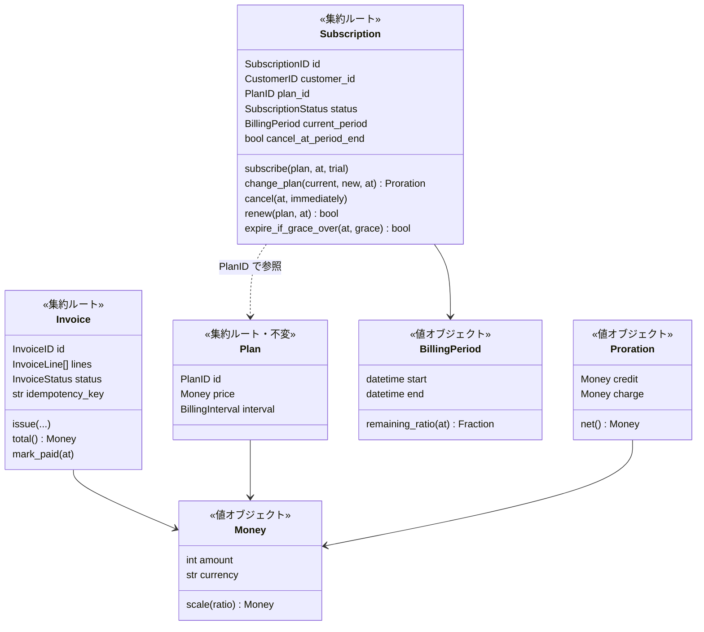
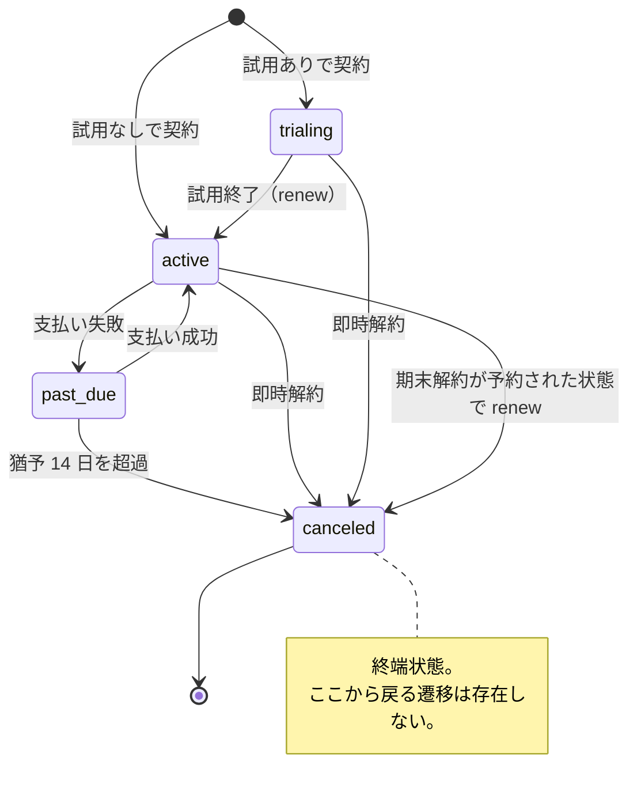

# ドメインモデル

## 集約



集約は 3 つ、その境界は**ライフサイクルの違い**で引いています。

- `Subscription` と `Invoice` を分けるのは、**発行済みの請求書が契約の現在の状態とは
  独立した記録**だからです。契約を解約したからといって、過去の請求書が消えては困ります。
- `Subscription` は `Plan` を `PlanID` で参照するだけで実体を持ちません。
  抱え込むと「契約を 1 件読むためにプランも必ず読む」という結合が生まれます。
  プランの中身が必要な操作では、ユースケースが読んで引数で渡します。

## 状態遷移



`canceled` からは何もできません。`cancel` も `change_plan` も `renew` も
`IllegalTransition` で弾かれます。

### 請求書の状態

請求書は `open` から始まり、4 つの決着状態のいずれかに落ちます。

| 状態 | 意味 |
|---|---|
| `open` | 発行済みで支払い待ち。これだけが未決着 |
| `paid` | 支払い済み |
| `no_payment_due` | 請求額が 0 以下で、**決済の必要がないまま決着した** |
| `uncollectible` | 回収不能として締めた（貸倒れ） |
| `void` | 誤発行として無効化した |

`no_payment_due` があるのは、プラン変更で差額が 0 以下（減額、試用中の変更）でも
**請求書を必ず発行するため**です。作らないでいると冪等キーを記録する場所がなくなり、
再送が「すでにそのプランです」というエラーになります。
「支払われた」わけではないので `paid` とは区別します。

!!! note "期末解約はなぜ状態ではなくフラグなのか"
    「解約予約中」という状態を作らず、`cancel_at_period_end` というフラグにしています。
    こうすると**予約の取り消しが状態遷移ではなくフラグの解除**として扱え、
    状態機械が余計に複雑になりません。

## 日割り計算

このサンプルの中心にある計算です。純粋関数として `domain/proration.py` に置いてあります。

期間 `[start, end)` の途中 `at` でプランを変えたとき、残り割合は次のとおりです。

$$
\text{ratio} = \frac{\text{end} - \text{at}}{\text{end} - \text{start}}
$$

その期間はすでに旧プランの料金で請求済みという前提に立つので、
**使っていない分を返し、新しい料金で取り直します**。

$$
\text{credit} = \lfloor \text{old\_price} \times \text{ratio} \rfloor, \quad
\text{charge} = \lfloor \text{new\_price} \times \text{ratio} \rfloor
$$

### 具体例

1 月（31 日）のちょうど半分、1/16 12:00 に Basic（1,000 円）から Pro（3,000 円）へ。

| 項目 | 計算 | 金額 |
|---|---|---|
| Basic 未使用分 | 1,000 × 1/2 | **-500 円** |
| Pro 残期間分 | 3,000 × 1/2 | **+1,500 円** |
| 差し引き | | **1,000 円** |

請求書には合計ではなく**内訳の 2 行**が載ります。
合計だけ渡されても、顧客からの問い合わせに答えられないからです。

### 金額に float を使わない

`Money` は通貨の最小単位を整数で保持します。日本円なら円、米ドルならセントです。

```python
@dataclass(frozen=True, slots=True)
class Money:
    amount: int
    currency: str = "JPY"
```

比率も `Fraction`（Go では `big.Rat`）で厳密に扱い、掛けたあとに一度だけ丸めます。
`0.1 + 0.2 != 0.3` の世界で請求書を作ると、丸め誤差がそのまま会計上の差異になります。

丸めは**切り捨てで統一**し、`Money.scale` の 1 箇所に閉じ込めています。
日割りでは事業者ではなく利用者に有利な方向へ倒す、という方針です。
方針を変えたくなったら、変えるのはこのメソッドだけで済みます。

## 時刻の扱い

### 半開区間

請求期間は `[start, end)` です。終端を含めません。
こうすると、ある期間の `end` と次の期間の `start` が同じ値になり、隙間も重複も生まれません。
「23:59:59 まで」と書くと、閏秒やマイクロ秒の扱いで必ずどこかに穴が空きます。

### 更新の起点は「今」ではない

```python
# 新しい期間の起点は前の期間の終わり
self.current_period = BillingPeriod.starting_at(self.current_period.end, plan.interval)
```

バッチが数時間遅れて動いても請求日がずれません。地味ですが重要な一行です。

### 月末の丸め

1/31 の 1 か月後は 2/28（閏年なら 2/29）とします。
これは課金サイクルの仕様そのものなので、ライブラリ任せにせずドメインに書いています。

```python
def add_months(value: datetime, months: int) -> datetime:
    total = (value.year * 12 + (value.month - 1)) + months
    year, month = divmod(total, 12)
    month += 1
    day = min(value.day, calendar.monthrange(year, month)[1])
    return value.replace(year=year, month=month, day=day)
```

Go の `time.AddDate` は 2/31 を 3/3 に繰り上げてしまうので、そのままでは使えません。

### すべて tz-aware / UTC

ドメインに入る `datetime` は tz-aware であることを検査し、UTC に正規化します。
ローカル時刻のまま計算すると、夏時間の切り替え日に請求期間が 23 時間や 25 時間になります。

```python
def ensure_aware(value: datetime, *, field: str) -> datetime:
    if value.tzinfo is None or value.tzinfo.utcoffset(value) is None:
        raise InvariantViolation(f"{field} must be timezone-aware, got naive {value.isoformat()}")
    return value.astimezone(UTC)
```

永続化するときは**固定長の ISO 8601 文字列**にします。桁数を固定するのは、
文字列の辞書順と時刻の順序を一致させるためです。
これが崩れると `WHERE period_end <= ?` が静かに嘘をつきます。

## 猶予期間

支払いに失敗しても即座には解約しません。`past_due` に落として 14 日待ちます。

```python
def mark_payment_failed(self, *, at: datetime) -> None:
    if self.status is SubscriptionStatus.PAST_DUE:
        # すでに延滞中。猶予の起点は最初の失敗のままにする。
        return
    self.status = SubscriptionStatus.PAST_DUE
    self.past_due_since = at
```

**再試行のたびに `past_due_since` を更新しない**のが要点です。更新してしまうと、
リトライが走るたびに猶予が延び、永遠に解約されない契約ができます。

## ドメインイベント

集約は「起きたこと」を記録するだけで、それを何に使うかは外側が決めます。

```python
subscription.pull_events()
# [SubscriptionEvent(name="subscription.created", ...),
#  SubscriptionEvent(name="subscription.canceled", ...)]
```

「解約されたらメールを送る」をドメインに書かないための逃げ道です。
このサンプルではイベントを記録するところまでで、購読側は実装していません
（[あえて省いたもの](design-decisions.md) を参照）。
