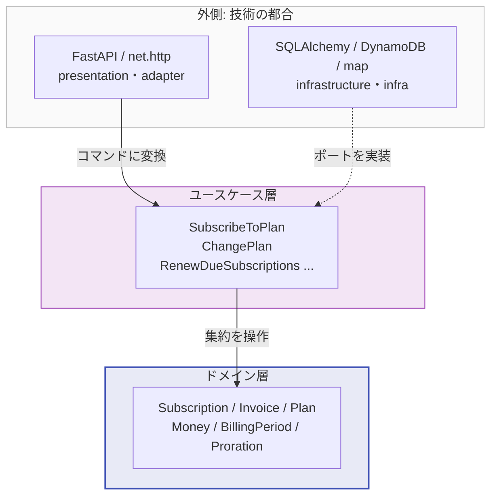

# クリーンアーキテクチャで作るサブスクリプション課金

サブスクリプション課金という、それなりにルールの込み入った題材を、クリーンアーキテクチャで
組んだサンプルです。**同じドメインを Python/FastAPI と Go の 2 言語で実装**し、
Python 側は **インメモリ・SQLite・DynamoDB の 3 つの永続化実装**の上で動かしています。

!!! note "このサンプルが答えようとしている問い"
    「レイヤーを分けました」で終わらせず、**分けたことが機能しているかを機械的に検証する**
    ことを目指しています。具体的には次の 3 つです。

    1. ドメイン層は本当にフレームワークから独立しているか → [依存の向きを検査するテスト](architecture.md#依存の向きをテストで守る)
    2. 永続化技術は本当に差し替えられるか → [SQL と key-value NoSQL で同じ契約テストを回す](persistence-portability.md)
    3. 言語が変わっても同じ構造が成立するか → [Python と Go の比較](python-vs-go.md)

## 題材: なぜ課金なのか

CRUD だけの題材だと、レイヤーが全部素通しになり、ただの遠回りなコードになります。
サブスクリプション課金には、外側の都合では決められない**守るべき不変条件**があります。

- 期間の途中でプランを変えたら、旧プランの未使用分を返し、新プランの残期間分を請求する（**日割り**）
- 支払いに失敗したら即解約ではなく、14 日の猶予を置いてから解約する
- 同じ請求が二度実行されてはいけない（**冪等性**）
- 解約済みの契約は、二度と課金対象にならない

これらは HTTP でも DynamoDB でもなく、**ビジネスの言葉**で書かれるべきものです。
そしてそれをどこに書くかが、このサンプルの主題です。

!!! tip "DDD の用語がはじめての場合"
    「集約」「値オブジェクト」「リポジトリ」といった言葉を、
    このプロジェクトのコードと対応させて [DDD の用語](ddd-glossary.md) に説明しました。
    レイヤーの話より先にそちらを読んでも構いません。

## 30 秒で動かす

=== "Python"

    ```bash
    cd python
    uv sync
    uv run uvicorn billing.presentation.main:app --reload
    ```

    <http://127.0.0.1:8000/docs> で OpenAPI の画面が開きます。

=== "Go"

    ```bash
    cd go
    go run ./cmd/api
    ```

    `http://127.0.0.1:8080/health` が応答します。

永続化は環境変数だけで切り替わります。**アプリケーションのコードは 1 行も変わりません。**

=== "Python"

    ```bash
    BILLING_PERSISTENCE=sqlite uv run uvicorn billing.presentation.main:app
    ```

=== "Go"

    ```bash
    BILLING_PERSISTENCE=sqlite go run ./cmd/api
    ```

## 一連の流れを試す

```bash
curl -s -X POST localhost:8000/subscriptions \
  -H 'content-type: application/json' \
  -d '{"customer_id": "cus-1", "plan_id": "basic"}'
```

返ってきた契約 ID を使って、期間の途中でプランを上げます。冪等キーは必須です。

```bash
curl -s -X POST localhost:8000/subscriptions/$SUBSCRIPTION_ID/plan-changes \
  -H 'content-type: application/json' \
  -H 'Idempotency-Key: change-1' \
  -d '{"new_plan_id": "pro"}'
```

差額の内訳が返ります。同じ `Idempotency-Key` でもう一度送っても、**二重に課金されません**。

## 全体像



矢印はすべて内向きです。ドメイン層は自分の外側に何があるかを知りません。
この性質は [テストで機械的に検証](architecture.md#依存の向きをテストで守る) しています。

## リポジトリの構成

```
python/src/billing/
├── domain/          標準ライブラリのみ。ビジネスルール
├── application/     ユースケースとポート定義
├── infrastructure/  memory / SQLite / DynamoDB、決済代行、時計
└── presentation/    FastAPI と合成ルート

go/internal/
├── domain/          標準ライブラリのみ
├── usecase/         ユースケースとポート定義
├── infra/           memory / SQLite、決済代行、時計
├── adapter/http/    net/http のハンドラ
└── app/             合成ルート
```
