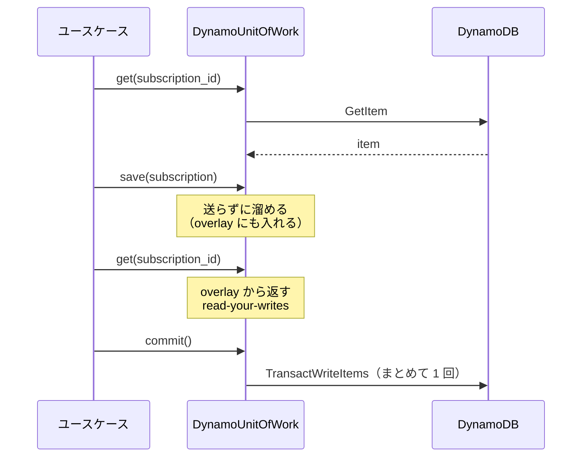

# 永続化は本当に閉じ込められるか

「リポジトリパターンを使えば DB を差し替えられる」とよく言われます。
では **SQL から key-value NoSQL に替えても本当に成立するのか**。
それを確かめるために、Python 側に 3 つの永続化実装を用意しました。

| 実装 | データモデル | トランザクション | 競合の防ぎ方 |
|---|---|---|---|
| インメモリ | `dict` | スナップショット + 反映 | バージョン比較 |
| SQLite | 4 テーブルに正規化 | `BEGIN` / `COMMIT` | `UPDATE ... WHERE version = ?` |
| DynamoDB | 1 テーブル + 2 GSI | `TransactWriteItems`（書き込みのみ） | 条件付き書き込み |

## 結論

**インターフェースは閉じ込められます。暗黙の前提は漏れます。**

ユースケース層のコードは 1 行も分岐していません。`ChangePlan` は自分が SQL を
相手にしているのか DynamoDB を相手にしているのかを知らないまま動きます。
それは [契約テスト](#契約テストが証明していること) が 3 実装すべてで通ることで証明できます。

一方で、インターフェースのシグネチャには現れない前提が 4 つ漏れました。以下で個別に見ます。

## 漏れなかったもの

### 絞り込みのクエリ

`list_due(at, limit)`（期限の来た契約を返す）は、SQL ではインデックス付きの `WHERE` です。

```sql
SELECT ... FROM subscriptions
WHERE status IN ('active','trialing','past_due') AND period_end <= ?
ORDER BY period_end LIMIT ?
```

DynamoDB では **sparse GSI** で表現します。解約済みになった瞬間に GSI のキー属性を
書かないことで、その項目は索引から自動的に外れます。

```python
"gsi1pk": LIVE_PARTITION if is_live else None,   # 解約済みなら属性ごと消える
"gsi1sk": period_end_iso if is_live else None,
```

```python
items = self._session.query(
    index=GSI1,
    key_condition="gsi1pk = :live AND gsi1sk <= :now",
    values={":live": LIVE_PARTITION, ":now": require_iso(at)},
    limit=limit,
)
```

「解約済みを除外する」という条件をクエリに書く必要すらなくなります。
**インターフェースの形は変えずに、それぞれの得意な形で実装できました。**

!!! note "ただし設計の作法は違う"
    `list_due` を「全件返して呼び出し側で絞る」形にしていたら、DynamoDB では
    フルスキャンになって破綻していました。絞り込みの条件を**ドメインの言葉で**
    インターフェースに書いておいたことが効いています。

### 冪等キーの一意性

SQL では `UNIQUE` 制約です。DynamoDB には `UNIQUE` がありませんが、
**冪等キーそのものを 1 つの項目にして、条件付き書き込みで作る**ことで表現できます。

```python
self._session.stage(
    key=idempotency_key(key),                    # PK = "IDEM#<key>"
    item={..., "invoice_id": entity_id},
    condition="attribute_not_exists(pk)",        # まだ無いときだけ書ける
    ...
)
```

請求書本体と同じ `TransactWriteItems` に入るので、片方だけが残ることはありません。
**むしろ DynamoDB のほうが意図が明示的**です。SQL の `UNIQUE` は宣言してしまえば
見えなくなりますが、こちらは「一意性を守るために項目を 1 つ作っている」とコードに書いてあります。

## 漏れたもの

### 1. UnitOfWork の意味論

DynamoDB に「トランザクションを開く」という操作はありません。あるのは
`TransactWriteItems`、つまり「複数の書き込みを 1 発でまとめて送る」API だけです。
**読み取りはその外側**で行われます。

そこで DynamoDB 版の `UnitOfWork` は、書き込みをいったん手元に溜め、`commit` で一括送信します。



`__enter__` で何も始まらないのが SQL 版との最大の違いです。
データベース側には何の状態も作られないので、`rollback` は溜めた箱を捨てるだけで済みます。
そのかわり、**読み取りの一貫性は何も保証されません**。

具体的に再現できないもの:

- 同じトランザクション内で 2 回読むと違う値が返りうる（SQL の `REPEATABLE READ` 相当がない）
- 未 commit の書き込みが、同じトランザクション内の**クエリ**には反映されない
  （`get` は overlay で救えますが、GSI は書き込みが確定して初めて更新されます）

### 2. トランザクションのサイズ上限

`TransactWriteItems` は **100 項目**が上限です。これはインターフェースのどこにも書かれていません。

```python
if len(staged) > TRANSACTION_ITEM_LIMIT:
    raise RuntimeError(
        f"this unit of work touches {len(staged)} items, but DynamoDB "
        f"transactions are limited to {TRANSACTION_ITEM_LIMIT}"
    )
```

当初、更新バッチの `_expire_past_due` は猶予切れの契約をまとめて 1 トランザクションで
更新していました。SQL なら 1 万件でも動きますが、DynamoDB では 101 件目で落ちます。
**ユースケース側の `limit` の値が、永続化実装の制約と結びついてしまっていた**わけです。

これを、更新処理と同じく **1 件 1 トランザクション**に寄せて解消しました。

```python title="application/usecases/renew_due_subscriptions.py"
def _expire_past_due(self, *, limit: int) -> int:
    with self._uow_factory() as uow:
        past_due_ids = [s.id for s in uow.subscriptions.list_past_due(limit=limit)]

    canceled = 0
    for subscription_id in past_due_ids:
        if self._expire_one(subscription_id):   # 1 件ごとにトランザクションを開く
            canceled += 1
    return canceled
```

!!! warning "「漏れがなくなった」わけではない"
    100 項目の上限は依然として存在し、インターフェースのどこにも書かれていません。
    やったのは **抽象を直すことではなく、どの実装でも成立する粒度に設計を寄せること**です。

    言い換えると、この抽象は「3 実装の最小公倍数」でしか安全に使えません。
    リポジトリパターンを入れれば永続化のことを考えなくてよくなる、わけではない
    という具体例です。

    副産物として「途中で落ちても、次の起動が続きから拾う」も手に入りました。
    バッチとしてはそもそもこちらが正しい形です。

### 3. 悲観ロックが存在しない

SQL なら `SELECT ... FOR UPDATE` で行を掴めます。DynamoDB にはそれがありません。
選択肢は楽観ロックしかない。

そこで **3 実装すべてを楽観ロックで統一**しました。

```python
# SQL: 影響行数で判定
result = conn.execute(
    subscriptions.update()
    .where(and_(subscriptions.c.id == entity_id, subscriptions.c.version == expected))
    .values(..., version=expected + 1)
)
if result.rowcount != 1:
    raise ConcurrencyConflict("subscription", entity_id)
```

```python
# DynamoDB: 条件付き書き込み
self._session.stage(
    key=subscription_key(subscription.id),
    item=subscription_to_item(subscription, version=expected + 1),
    condition="version = :expected_version",
    values={":expected_version": expected},
)
```

!!! important "バージョン番号はドメインに持たせない"
    `Subscription` に `version` フィールドを生やした瞬間、インフラの都合がドメインに漏れます。
    代わりに **リポジトリが「この UnitOfWork の中で、この ID をバージョン幾つで読んだか」を
    記録**します（`VersionTracker`）。ドメインモデルは楽観ロックの存在を最後まで知りません。
    詳細は [ADR-0004](adr/0004-optimistic-locking.md)。

### 4. 衝突がいつ分かるか

ここが一番厄介でした。

| 実装 | 衝突が判明する場所 |
|---|---|
| インメモリ | `save()` |
| SQLite | `save()`（`UPDATE` の影響行数が 0） |
| DynamoDB | **`commit()`**（`TransactWriteItems` を送るまで分からない） |

DynamoDB 版の `save` は書き込みを溜めるだけなので、その時点では何も検証できません。
したがって、契約としてはこう定めるしかありませんでした。

> 楽観ロックの衝突は `save` または `commit` のどちらかで送出される。
> 呼び出し側は両方を囲んで捕まえること。

契約テストもその形で書いてあります。

```python
with pytest.raises(ConcurrencyConflict):
    outer.subscriptions.save(stale)
    outer.commit()
```

これは抽象の漏れですが、**漏れを隠さずに契約として明文化した**という整理です。
「どちらか一方でしか起きない」と嘘をつくより、テストで両方を許容するほうが正直です。

### おまけ: SQLite でも同じ問題が起きた

Go 版の SQLite で WAL モードを有効にしたところ、古いスナップショットを読んだまま
書き込もうとしたトランザクションが `SQLITE_BUSY_SNAPSHOT` で弾かれました。

意味としては楽観ロックの衝突とまったく同じ（SQLite 自身が lost update を防いでいる）なので、
インフラ層で翻訳しています。

```go
const sqliteBusySnapshot = 517

func asConflict(err error, entity, id string) error {
    var sqliteErr *sqlitedriver.Error
    if errors.As(err, &sqliteErr) && sqliteErr.Code() == sqliteBusySnapshot {
        return usecase.ConcurrencyConflict(entity, id)
    }
    return err
}
```

**version 列の突き合わせより先にデータベースが弾いてくれることがある。
どちらの経路で分かっても、上の層に届く言葉は同じでなければならない** ——
これがインフラ層の責任です。

## 契約テストが証明していること

「インターフェースが同じ」だけでは意味がありません。「**同じように振る舞う**」ことが必要です。

`python/tests/contract/test_repository_contract.py` の 17 個のテストは、
`uow_factory` フィクスチャによって memory / SQLite / DynamoDB の 3 通りで実行されます。
テストコードには 1 箇所も分岐がありません。

```python
@pytest.fixture(params=["memory", "sqlite", "dynamodb"])
def persistence(request: pytest.FixtureRequest) -> str:
    return str(request.param)
```

検証している契約:

- 保存して読み直したものが元と同じ（値オブジェクトの分解と再構築、タイムゾーンの保持）
- `commit` しなければ何も残らない
- 明示的な `rollback` で変更が消える
- 同じ ID / 同じ冪等キーで 2 つ目は作れない
- `list_due` は満了した契約だけを返し、解約済みを含まない
- `limit` が効く
- 先に読んだ側が後から書くと弾かれる
- 読まずに `save` すると弾かれる

!!! success "実際にバグを 1 つ見つけました"
    インメモリ実装は `deepcopy` でスナップショットを取る方式でした。その結果、
    **他のトランザクションが先に更新したことに永遠に気づけない**状態になっていて、
    楽観ロックのテストだけが memory で落ちました。

    修正は「バージョンの比較を、作業コピーではなくコミット済みの実体に対して行う」。
    テスト用の実装であっても本物と同じ意味論を持たせなければ、
    インメモリで通ったテストの意味が消えます。

## 実務で選ぶとしたら

このサンプルの範囲では DynamoDB でも成立しました。ただし成立させるために、
**キー設計をドメインの要求から逆算する**必要がありました
（`list_due` のための sparse GSI、冪等キーのための専用項目）。

つまり「あとから DB を差し替える」のは、リポジトリパターンがあっても**タダではありません**。
差し替えられるのは呼び出し側のコードであって、キー設計と整合性モデルの検討は必ず発生します。

リポジトリパターンの本当の価値は「DB をいつでも替えられる」ことではなく、
**ビジネスルールを DB のことを考えずにテストできる**ことのほうにあります。
このサンプルでドメイン層のテストが 0.2 秒で終わるのは、その副産物です。
